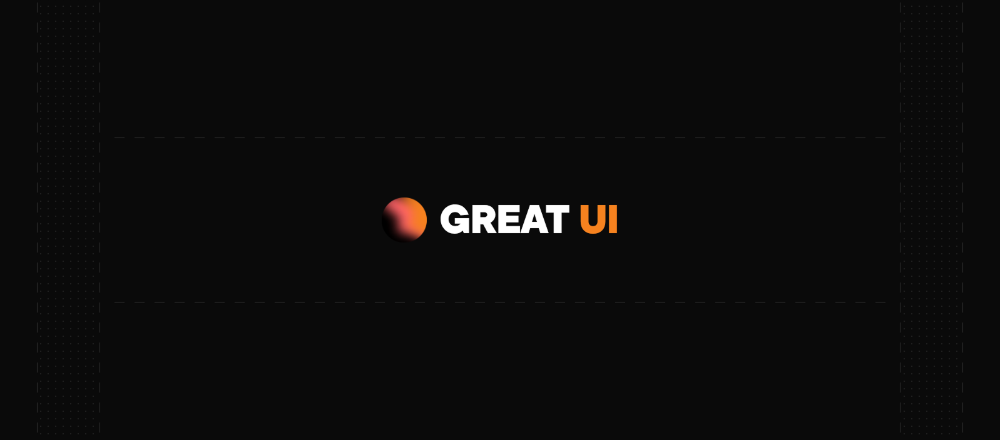

<div align="center">
  
</div>

<h1 align="center">Great UI</h1>

<p align="center">
  <strong>Craft Premium React Interfaces with Absolute Speed</strong>
</p>

<p align="center">
  Beautiful, accessible, and high-performance React components built with Tailwind CSS. Copy, paste, and build premium interfaces instantly.
</p>

<p align="center">
  <a href="https://great-ui.com">Documentation</a> ·
  <a href="https://great-ui.com">Components</a> ·
  <a href="https://github.com/Saurabh-2607/GreatUI/issues">Report Bug</a> ·
  <a href="https://github.com/Saurabh-2607/GreatUI/issues">Request Feature</a>
</p>

<p align="center">
  <a href="https://github.com/Saurabh-2607/GreatUI/blob/main/LICENSE">
    
  </a>
</p>

---

## Introduction

Great UI is a collection of beautiful, accessible, and high-performance React components built with Tailwind CSS. Just copy the code, paste it into your project, and build premium interfaces instantly.

### Why Great UI?

- **Copy & Paste** - Not a dependency. You own the code.
- **Interactive** - Smooth animations, custom dark mode transitions, and sleek designs.
- **Customizable** - Built with Tailwind CSS v4. Easy to modify.
- **Accessible** - WAI-ARIA compliant components.
- **Dark Mode** - All components support light and dark modes with high-contrast variants.
- **TypeScript** - Fully typed for the best developer experience.

## Development

### Setup

```bash
# Clone the repository
git clone https://github.com/Saurabh-2607/GreatUI.git
cd GreatUI

# Install dependencies
npm install

# Start development server
npm run dev
```

### Project Structure

```
GreatUI/
├── app/                 # Next.js Application Route Layouts & Pages
├── components/          # Reusable UI component modules
├── lib/                 # Component registry metadata registry
└── public/              # Static logo assets & public files
```

### Available Scripts

| Command          | Description                    |
| ---------------- | ------------------------------ |
| `npm run dev`    | Start local development server |
| `npm run build`  | Build the Next.js application  |
| `npm run lint`   | Run ESLint syntax check        |
| `npm run format` | Format code with Prettier      |

## Contributing

We welcome contributions! Whether it's:

- Reporting a bug
- Submitting a fix
- Proposing new features
- Creating new components

### How to Contribute

1. Fork the repository
2. Create your feature branch (`git checkout -b feature/amazing-component`)
3. Commit your changes (`git commit -m 'Add amazing component'`)
4. Push to the branch (`git push origin feature/amazing-component`)
5. Open a Pull Request

### Component Guidelines

When creating new components:

- Use TypeScript with proper type definitions
- Support both light and dark modes
- Include comprehensive props with sensible defaults
- Follow existing code styles and patterns

## Tech Stack

- **Framework**: [Next.js 16](https://nextjs.org/)
- **Styling**: [Tailwind CSS 4](https://tailwindcss.com/)
- **Components**: [React 19](https://react.dev/)
- **Package Manager**: [npm](https://www.npmjs.com/)

## Acknowledgments

- Inspired by [Cloudflare](https://cloudflare.com/)
- Built with [Tailwind CSS](https://tailwindcss.com/)

## License

MIT License - feel free to use these components in personal and commercial projects.

---

<p align="center">
  Made with care by <a href="https://github.com/Saurabh-2607">Saurabh</a>
</p>
